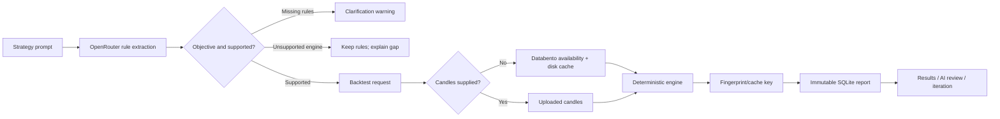
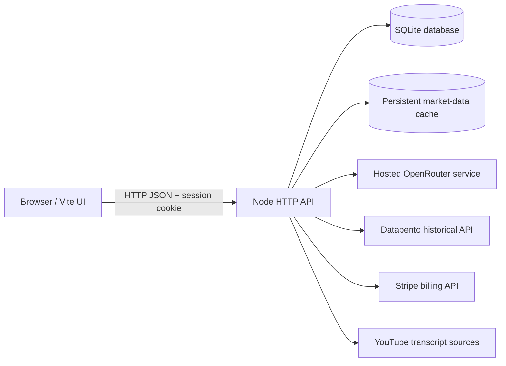

# Trading Forge / EdgeLab — Complete System Inventory

> Generated: July 5, 2026 (America/New_York)  
> Project root: `C:\Users\phill\trading-forge`  
> Runtime product name: **EdgeLab**  
> Package version: `0.3.0`

This is the current-state source of truth for what exists, what is running, what every visible tab does, what is saved, and how the major systems work. Secret values are intentionally excluded.

## 1. Executive summary

The repository contains two overlapping experiences:

1. **Server-backed SaaS** — accounts, OpenRouter clarification, Databento data, SQLite persistence, immutable reports, AI review/game planning, versions, sharing, plans, transcripts, and admin metrics.
2. **Local/demo research app** — browser-local strategies, runs, preferences, illustrative/uploaded candles, dashboard, comparisons, Pine generation, and several client-side engines.

### Active runtime

| Service | Address | Running command | Purpose |
|---|---:|---|---|
| Vite frontend | `127.0.0.1:5173` | `vite --host 127.0.0.1` | React UI and `/api` proxy |
| EdgeLab API | `127.0.0.1:8787` | `node --env-file=.env server/server.mjs` | Auth, AI, data, engines, reports |
| OpenRouter | `https://openrouter.ai/api/v1/chat/completions` | `openrouter.exe serve` | Hosted inference |

### Current saved-state snapshot

| Store | Count/size |
|---|---:|
| SQLite users | 2 |
| Sessions | 3 |
| Subscriptions | 2 |
| Server strategies / versions | 0 / 0 |
| Immutable reports | 1 |
| Usage events | 11 |
| Transcript sources | 0 |
| Market cache | 17 files / ~33.4 MB |
| Other data files | 6 files / ~1.36 MB |

## 2. Browser routes and tabs

Routing is hash-based in `src/Root.tsx`.

| Route | Component | Access | Function | Persistence |
|---|---|---|---|---|
| `#/` / `#top` | Landing | Public | Product explanation and entry links | None |
| `#/saas` | `SaaSWorkspace` | Auth form when signed out | One-click prompt → rules → data → report | SQLite + usage |
| `#/daily-level` | `DailyLevelWorkspace` | Auth | Prior-day breakout/sweep research | SQLite reports |
| `#/plans` | `SaaSPlans` | Public view | Plans, trial, Stripe, Pine exports | Subscription/usage |
| `#/samples` | `SaaSSamples` | Public | Templates, published reports, clone handoff | Temporary localStorage |
| `#/transcripts` | `TranscriptBuilder` | Paid/auth | Notes/transcript extraction | SQLite source + usage |
| `admin.html` local ops app | `AdminDashboard` | Trusted local/admin process | Product/usage/business metrics and data controls | Admin API enabled explicitly |
| `#/saas-reports` | `SaaSReports` | Auth | Latest full report plus History | Reports + AI usage |
| `#/saas-reports/:id` | `SaaSReports` | Owner/auth | Specific immutable report | Visibility only |
| `#/shared-reports/:id` | `SaaSReports` | Public if shared | Read-only public report | None |
| `#/app` | `App` | Public/local | Demo workspace/dashboard/library | localStorage |
| `#/strategy-lab` | `StrategyLab` | Public/local | Multi-engine uploaded-data lab | localStorage |
| `#/runs` / `#/runs/:id` | `RunArchive` | Public/local | Local run list/detail | localStorage |

### SaaS sidebar

- **Workspace:** validator, automatic data, exact rules, report, advanced controls.
- **Reports:** smaller inline list; overlaps with richer `#/saas-reports`.
- **Account:** identity, plan usage, strategy/version counts, upgrade path.
- **Plan card:** monthly backtest quota.
- **Log out:** deletes server session and clears cookie.
- Fixed shortcuts: Previous-day lab, Transcript builder, Strategy packs, Plans & exports.

### Local app sidebar

- Workspace
- Dashboard
- Strategies
- Comparison
- Preferences

This is the currently preferred visual sidebar design.

### Standalone Reports tabs

- **Latest results:** complete newest report by default.
- **History:** compact chronological list.

Owned reports include sharing, metrics, interactive equity/drawdown charts, exact rules, monthly results, trades, AI Review, Game Plan, Ask AI, and Iterate Strategy.

## 3. Core workflow

### One-click defaults

For a sparse ORB prompt the clarifier defaults to:

- Latest completed one year
- Monday through Friday unless named otherwise
- Continuous front futures contract
- America/New_York session time
- Candle-close breakout confirmation
- One trade/day
- Fees and slippage included
- No invented weekday restriction

### Databento lifecycle

`server/databento.mjs`:

1. Route futures to `GLBX.MDP3` continuous symbols (`NQ.c.0`).
2. Route SPY/QQQ/common equities to `EQUS.MINI` raw symbols.
3. Read entitlement-specific `ohlcv-1m` availability.
4. Clamp lookback to available history and maximum four years.
5. Use stable monthly historical chunks and daily current-month chunks.
6. Hash dataset, symbol, schema, start, end, and timezone.
7. Read `data/market-cache/<sha256>.json`.
8. Download only missing chunks.
9. Write atomically with temp-file + rename.
10. Convert to strategy timezone, aggregate timeframe, deduplicate, and sort.

Cache is shared across users because market data is not user-specific.

### Backtest/report cache

Report identity includes exact rules, engine parameters, candle fingerprint, and engine version. Exact user/cache matches return the existing report. Shared computation can reuse result JSON. Rules/results remain immutable; only visibility can change.

### AI clarification

- OpenRouter `/api/chat`, default `gemma3:12b`, JSON mode, low temperature.
- Deterministic baseline from `prompt-parser.mjs`.
- Promotional prose is separated from executable rules.
- Numeric rules override narrative phrases.
- Bollinger/RSI/ATR parameters are retained.
- AI never generates backtest performance.

### AI report review/game plan

The model receives only frozen rules and calculated evidence: engine version, total/average R, win rate, counts, profit factor, drawdown, streak, best/worst month, monthly data, first/last trade, and question.

It is prohibited from inventing trades, metrics, regimes, causes, profitability, or guarantees. Output is structured as headline, summary, evidence, controlled experiments, risks, and answer. Game Plan requires one-variable experiments plus holdout/walk-forward validation.

### Iterate Strategy

A report stores exact rules and an iteration prompt in temporary localStorage, navigates to `#/saas`, initializes a new draft, then removes the handoff keys. The original report remains immutable.

## 4. Persistence inventory

### SQLite: `data/edgelab.sqlite`

WAL mode is enabled, so `-wal` and `-shm` companion files may exist.

| Table | Purpose | Key contents |
|---|---|---|
| `users` | Account identity | email, scrypt hash, name, role, timestamps |
| `sessions` | Browser login sessions | user, token hash, expiration, last seen |
| `subscriptions` | Entitlements | free/trial/pro, status, dates, provider IDs |
| `strategies` | Stable strategy identity | owner, name/type, favorite/archive |
| `strategy_versions` | Immutable revisions | parent, prompt, rules JSON, parameters, summary |
| `reports` | Immutable evidence | cache key, engine/data fingerprint, rules/result JSON, visibility |
| `usage_events` | Metering/analytics | event type, quantity, metadata, time |
| `transcript_sources` | Saved notes/transcripts | source metadata, content, extraction JSON |

Security behavior:

- Passwords: scrypt + random 16-byte salt.
- Sessions: random 32-byte token; only SHA-256 hash stored.
- Cookie: `edgelab_session`, HttpOnly, SameSite=Lax, 30 days; Secure in production.
- Logout deletes the server row and clears the cookie.

### Market-data cache

Directory: `data/market-cache`.

Each JSON file stores cache version, source, exact query, cache timestamp, and normalized candles. Filename is the SHA-256 query digest. There is currently no eviction policy or cache admin screen.

### Browser localStorage

| Key | Purpose | Lifetime |
|---|---|---|
| `edgelab.strategies.v1` | Local saved strategies | Persistent |
| `edgelab.runs.v1` | Last 50 local runs | Persistent |
| `edgelab.preferences.v1` | Local defaults/theme | Persistent |
| `edgelab.samplePrompt` | Sample → workspace clone | Removed after load |
| `edgelab.iterateRules` | Report rules → workspace | Removed after load |
| `edgelab.iteratePrompt` | Report iteration instruction | Removed after load |

Local runs and server reports are independent systems.

## 5. Plan limits

| Capability | Free | Trial | Pro |
|---|---:|---:|---:|
| Backtests/month | 5 | 50 | 500 |
| Saved strategies | 3 | 25 | 250 |
| Saved reports | 3 | 50 | 1,000 |
| Pine exports/month | 0 | 20 | 500 |
| Transcript extractions/month | 0 | 5 | 100 |
| Comparisons/month | 0 | 20 | 500 |

Expired trials and past-due/canceled plans fall back to Free. Monthly usage starts at the first UTC day. Stored-object limits and monthly event limits are enforced separately.

## 6. Strategy engines

### Server engines

**ORB (`server/orb-engine.mjs`, version `orb-1.0.0`)**

- 1m/5m/15m candles
- 5/15/30/60-minute range
- Weekday filter
- Long/short/both
- Candle-close or wick confirmation
- Opposite-side stop
- Fixed R target
- Trades/day limit
- Fee/slippage drag
- Stop-first same-bar policy
- Full R, monthly, equity, and drawdown metrics

**Daily-level (`server/daily-level-engine.mjs`, version `daily-level-1.0.0`)**

- Previous-day high/low breakout
- Previous-day failed-break/sweep reversal

### Client-side Strategy Lab engines

`src/strategyEngines.ts` implements:

- Previous-day breakout
- Previous-day sweep
- Moving-average crossover
- Moving-average pullback
- RSI reversal
- Support/resistance breakout

Defaults: MA 9/21, RSI 14/30/70, lookback 20, stop lookback 5.

### Engine gap

The AI can structure Bollinger + RSI + ATR rules, but a dedicated server engine is not implemented. The UI distinguishes objective-but-unsupported from genuinely undefined rules.

## 7. API catalog

### Public/system

| Method | Endpoint | Purpose |
|---|---|---|
| GET | `/api/health` | Health and engine version |
| GET | `/api/public/reports` | Public gallery |
| GET | `/api/public/reports/:id` | Public report detail |

### Auth/account

| Method | Endpoint | Purpose |
|---|---|---|
| POST | `/api/auth/register` | Account and session |
| POST | `/api/auth/login` | Session creation |
| POST | `/api/auth/logout` | Session deletion |
| GET | `/api/account` | Account, plan, usage |

### AI

| Method | Endpoint | Purpose |
|---|---|---|
| POST | `/api/ai/parse-rules` | Strategy clarification |
| POST | `/api/reports/:id/ai-review` | Review, game plan, or report question |

### Strategies/backtests

| Method | Endpoint | Purpose |
|---|---|---|
| GET/POST | `/api/strategies` | List/create strategy |
| GET | `/api/strategies/:id` | Strategy and versions |
| POST | `/api/strategies/:id/versions` | New immutable version |
| POST | `/api/backtests/orb` | ORB test; auto-fetch if candles omitted |
| POST | `/api/backtests/daily-level` | Daily-level test |

### Reports

| Method | Endpoint | Purpose |
|---|---|---|
| GET | `/api/reports` | Owned reports |
| GET | `/api/reports/:id` | Report detail |
| PATCH | `/api/reports/:id` | Visibility |
| POST | `/api/reports/:id/pine` | Pine export |

### Transcripts/billing/admin

| Method | Endpoint | Purpose |
|---|---|---|
| GET/POST | `/api/transcripts` | List/create extraction |
| POST | `/api/billing/trial` | Start trial |
| POST | `/api/billing/checkout` | Stripe Checkout |
| POST | `/api/billing/portal` | Stripe portal |
| POST | `/api/billing/stripe-webhook` | Stripe lifecycle |
| POST | `/api/billing/webhook` | Legacy signed event |
| GET | `/api/admin/metrics` | Admin-only metrics; disabled unless the separate ops API is explicitly enabled |

## 8. Billing and transcripts

Stripe supports Checkout, customer portal, signature validation, timestamp tolerance, idempotent events, and subscription entitlement updates. Local Stripe secrets are currently absent, so local Checkout is not configured.

Transcript sources: YouTube/video transcript, trading/course notes, Discord, and X thread. Content and URL are validated, extraction is saved with assumptions/warnings, and paid usage is metered. Automatic YouTube transcript acquisition is not implemented; users provide text/source data.

## 9. Source-file catalog

### Root/configuration/deployment

| File | Role |
|---|---|
| `package.json` | Package identity, dependencies, scripts |
| `pnpm-lock.yaml` | Exact dependency graph |
| `pnpm-workspace.yaml` | Workspace declaration |
| `index.html` | Vite HTML entry |
| `vite.config.ts` | Canonical proxy/test config |
| `vite.config.js` | JS config copy; drift risk |
| `vite.config.d.ts` | Generated declarations |
| `tsconfig.json` | TS references |
| `tsconfig.app.json` | Frontend compiler config |
| `tsconfig.node.json` | Node/config compiler config |
| `Dockerfile.api` | API image |
| `Dockerfile.web` | Frontend image |
| `compose.yaml` | Web/API topology and volume |
| `deploy/nginx.conf` | Static hosting and API proxy |
| `.env.example` | Safe config template |
| `.env` | Ignored active secrets/config |
| `.gitignore` / `.dockerignore` | Build, secret, data exclusions |

### Product documents

- `PROJECT_OVERVIEW.md` — earlier overview.
- `SAAS_ARCHITECTURE.md` — earlier architecture.
- `SELLABLE_SAAS_GOAL.md` — product/monetization goals.
- `DEPLOYMENT.md` — deployment and Stripe runbook.
- `SYSTEM_INVENTORY.md` — this current inventory.

### Frontend pages

| File | Role |
|---|---|
| `src/main.tsx` | React entry and style imports |
| `src/Root.tsx` | Router and landing page |
| `src/types.ts` | Shared domain types |
| `src/SaaSWorkspace.tsx` | Auth, validator, sidebar, account, inline report list |
| `src/SaaSReports.tsx` | Full results/history, charts, sharing, AI desk, iteration |
| `src/SaaSPlans.tsx` | Public plans, trial, Stripe, exports |
| `src/SaaSSamples.tsx` | Strategy packs and public results |
| `src/DailyLevelWorkspace.tsx` | Previous-day strategy UI |
| `src/TranscriptBuilder.tsx` | Transcript extraction UI |
| `src/AdminDashboard.tsx` | Separate local ops metrics UI |
| `src/App.tsx` | Local demo app and preferred sidebar/dashboard |
| `src/StrategyLab.tsx` | Local multi-engine lab |
| `src/RunArchive.tsx` | Local run history/detail |

### Frontend service/domain modules

| File | Role |
|---|---|
| `src/saas-api.ts` | Core API client |
| `src/saas-ops-api.ts` | Transcript/admin client |
| `src/billing-api.ts` | Billing client |
| `src/daily-level-api.ts` | Daily-level client |
| `src/storage.ts` | localStorage abstraction |
| `src/backtest.ts` | Local demo/ORB engine and CSV parsing |
| `src/strategyEngines.ts` | Local rule engines |
| `src/pine.ts` | Local ORB Pine generation |
| `src/pineStrategies.ts` | Multi-strategy Pine generation |
| `src/sample-strategies.ts` | 30 educational templates |

### Frontend styles

| File | Main owner |
|---|---|
| `src/styles.css` | Local app/dashboard/capital model |
| `src/themes.css` | Themes |
| `src/landing.css` | Landing and CTAs |
| `src/landing-saas.css` | Landing/SaaS alignment |
| `src/saas.css` | SaaS auth/sidebar/workspace |
| `src/server-reports.css` | Reports, charts, AI research desk |
| `src/report-sharing.css` | Visibility/public report UI |
| `src/plans.css` / `plans-link.css` | Plans and plan links |
| `src/samples.css` | Packs/gallery |
| `src/daily-level.css` | Daily-level UI |
| `src/operations.css` | Transcript/admin operations |
| `src/billing.css` | Billing UI |
| `src/strategy-lab.css` | Engine lab |
| `src/archive.css` | Run archive |
| `src/saas-shortcuts.css` | Fixed SaaS shortcuts |

### Backend core

| File | Role |
|---|---|
| `server/server.mjs` | HTTP routing/orchestration |
| `server/http.mjs` | JSON, auth guard, IDs, errors |
| `server/db.mjs` | SQLite schema/WAL/transactions |
| `server/auth.mjs` | Passwords, sessions, cookies |
| `server/validation.mjs` | Input validation |
| `server/services.mjs` | Strategies, versions, reports, ORB service |
| `server/plans.mjs` | Limits and metering |
| `server/cache.mjs` | Stable hashes/fingerprints/cache keys |

### Backend AI, data, engines

| File | Role |
|---|---|
| `server/prompt-parser.mjs` | Deterministic rules/defaults |
| `server/openrouter-parser.mjs` | AI structured extraction |
| `server/openrouter-review.mjs` | Grounded report AI |
| `server/databento.mjs` | Historical data, routing, disk cache |
| `server/orb-engine.mjs` | Server ORB engine |
| `server/daily-level-engine.mjs` | Daily-level engine |
| `server/daily-level-service.mjs` | Daily report cache/persistence |
| `server/pine-export.mjs` | Authorized Pine export |
| `server/transcripts.mjs` | Transcript persistence/extraction |
| `server/admin-metrics.mjs` | Admin aggregates |

### Backend billing

- `server/billing.mjs` — trial and legacy signed events.
- `server/stripe-billing.mjs` — Stripe calls/signatures/events.
- `server/stripe-routes.mjs` — checkout/portal/webhook routing.

### Tests

Observed: **30 frontend tests** and **14 server tests**.

Frontend test files:

- `backtest.test.ts`
- `billing.test.tsx`
- `dailyLevelWorkspace.test.tsx`
- `dailyReportRules.test.tsx`
- `operations.test.tsx`
- `plans.test.tsx`
- `preferences.test.tsx`
- `reportSharing.test.tsx`
- `saasReports.test.tsx`
- `saasWorkspace.test.tsx`
- `samples.test.tsx`
- `snapshotIntegrity.test.ts`
- `strategyEngines.test.ts`
- `strategyLab.test.tsx`
- `uploadedWorkflow.test.tsx`
- `workflow.test.tsx`

Server test files:

- `cache.test.mjs`
- `daily-level.test.mjs`
- `monetization.test.mjs`
- `server.test.mjs`
- `sharing.test.mjs`
- `stripe-billing.test.mjs`
- `stripe-routes.test.mjs`
- `transcripts.test.mjs`

## 10. Runtime configuration

Active local variable names:

- `PORT`, `HOST`, `NODE_ENV`
- `EDGELAB_DB_PATH`, `EDGELAB_APP_URL`
- `OPENROUTER_API_KEY`, `OPENROUTER_PREFLIGHT_MODEL`, `OPENROUTER_PARSER_MODEL`, `OPENROUTER_REVIEW_MODEL`
- `DATABENTO_API_KEY`

Additional supported names:

- `MARKET_DATA_CACHE_PATH`
- `STRIPE_SECRET_KEY`
- `STRIPE_WEBHOOK_SECRET`
- `STRIPE_PRO_PRICE_ID`
- `EDGELAB_BILLING_WEBHOOK_SECRET`
- `EDGELAB_HTTP_PORT`

Secret values must never appear in source, logs, reports, or browser bundles.

## 11. Commands

| Command | Purpose |
|---|---|
| `pnpm dev` | Vite frontend |
| `pnpm dev:server` | API watch mode |
| `pnpm server` | API normal mode |
| `pnpm build` | Type-check + production build |
| `pnpm preview` | Production preview |
| `pnpm test` | Frontend tests |
| `pnpm test:server` | Backend tests |
| `pnpm test:all` | All tests |
| `docker compose config/build/up -d/ps` | Deployment lifecycle |

## 12. Test and verification coverage

The repository has two principal automated test groups: frontend/application behavior tests and server tests. At inventory time, the suite contained approximately 30 frontend test cases and 14 server test cases. Coverage includes routing, sample strategies, browser-side engines, authentication and account behavior, report persistence, parser behavior, backtest calculations, market-data normalization, and subscription/plan logic.

### What the tests protect well

- Deterministic calculation behavior for the currently implemented engines.
- Strategy parsing contracts and unsupported-condition warnings.
- Account, session, and plan-limit behavior.
- Report creation and retrieval paths.
- Core route rendering and major user actions.

### Important additions

- End-to-end registration, login, plan selection, backtest, save, reopen, iterate, and publish flows.
- Multi-month and multi-year Databento stitching with overlaps, gaps, partial months, and upstream failures.
- Cache reuse across API restarts and concurrent requests for the same symbol/window.
- OpenRouter unavailable, model missing, malformed JSON, timeout, and retry behavior.
- Negative metric coloring and chart interaction accessibility.
- Stripe webhook replay/idempotency and entitlement changes.
- Container startup with persistent SQLite and market-data volumes.

### Practical verification commands

Use the package scripts documented above for automated checks. For runtime verification, confirm the API health endpoint, load each canonical browser route, run one cached and one uncached backtest, reopen the saved report, and verify that OpenRouter produces clarification and review output.
## 13. Deployment topology

### Local development

- Vite serves the React application on `127.0.0.1:5173`.
- The Node server serves JSON APIs on `127.0.0.1:8787`.
- Vite proxies `/api` requests to the Node server.
- OpenRouter is called as a hosted AI provider and handles strategy parsing and report analysis.
- SQLite and the market-data cache live on the local filesystem, so they survive normal server restarts.

### Container deployment

`compose.yaml` defines separate web and API services plus a persistent SQLite volume. The current container definition is a useful starting point, but it is not yet a complete production topology because OpenRouter is external, cached market data needs its own persistent mount, and the Databento/OpenRouter variables are not fully represented in the compose configuration.

### Deployment strengths

- The browser never receives the Databento key or billing secrets.
- Market data, calculation, and AI interpretation are separated by responsibility.
- Exact reports are persisted independently of transient UI state.
- SQLite makes backup and restoration straightforward for a single-node deployment.

### Deployment constraints

- SQLite permits one primary writer and is not a multi-node database strategy.
- There is no background job queue; long data downloads and backtests occupy an API request.
- OpenRouter availability and model installation are operational prerequisites.
- The cache path must be mounted persistently in containers or downloaded history will be lost on replacement.
- Production HTTPS, reverse proxying, log retention, monitoring, backups, and secret injection are not yet defined in this repository.

## 14. Known overlaps, limitations, and cleanup targets

### Two workspace experiences

The repository currently contains both the SaaS workspace and the older application workspace. They share concepts but use different screens, route names, state shapes, and in some cases different engines. Keeping both temporarily is useful for reference, but it makes navigation and ownership harder to understand. The SaaS route should become the canonical customer workflow, while proven visualizations and controls from the older app can be migrated deliberately.

### Multiple strategy representations

Strategies exist as prompt text, server-normalized JSON, local `StrategyDefinition` objects, saved strategies, versions, and immutable report rule snapshots. A single versioned schema should eventually be the boundary between clarification, execution, storage, comparison, and export. Until then, every new field should be checked across all of these representations.

### Split execution engines

The server currently has dedicated opening-range and daily-level backtest paths, while the frontend strategy engine supports several additional local strategy families. Results from different engines are not automatically comparable. Engine name and version should remain visible on every report, and new public strategy types should be added server-side before being presented as fully supported.

### Historical data limitations

- Databento coverage depends on dataset, symbol mapping, schema, entitlement, and available history.
- Futures continuous symbols and equity symbols follow different routing rules.
- Intraday requests may require multiple monthly calls; incomplete months must be detected rather than silently treated as a full test.
- Yahoo is not the current server data source despite earlier product discussion; Databento is the implemented automatic source.
- Cached data needs an explicit retention/eviction policy as symbol and interval usage grows.

### AI limitations

- OpenRouter clarifies and reviews; it must not invent candles, trades, or performance.
- Vague narrative statements should become warnings or explicit assumptions, not automatic rejection when the prompt also contains objective rules.
- The parser needs a stable supported-feature catalog so unsupported indicators and order behavior can be reported before data is downloaded.
- Model output must remain schema-validated because even a well-prompted local model can return malformed or contradictory JSON.

### Authentication and account state

- Session-cookie behavior depends on consistent hostnames, cookie settings, and the API proxy.
- Public sample pages and plan pages should remain browseable while account-only actions request authentication.
- UI labels must derive from the current account response rather than stale local state; this prevents signed-in users from seeing “Create an account.”

### Notices and transient UI state

Success and error banners should have a consistent lifecycle: dismissible, automatically expiring when appropriate, and cleared when a new operation starts. Persistent notices from previous actions make the current state ambiguous.

### Reports and sign handling

Metric color must be semantic. Negative total return, average R, profit factor below 1, and drawdown should not inherit a positive accent solely because they are headline metrics. The detailed report page is the canonical presentation; the library should show a compact, correctly signed summary and link to it.

### Interactive chart work still needed

The current charts communicate shape but need labeled axes, date/value tooltips, hover or pointer crosshairs, and pan/zoom or range selection. Those controls should operate on the exact persisted report series, not regenerated demo values.

### Billing and gated features

Feature gates exist in plan-limit configuration, but every paid capability must be checked on the server as well as hidden or explained in the UI. Comparison, transcript extraction, Pine export, report retention, and AI experiment volume are natural candidates for server-enforced limits.

### Security and operations

- Rotate any API credential that has ever been pasted into chat or committed accidentally.
- Keep `.env` untracked and use secret injection in production.
- Add request-size limits, rate limiting, structured logs, and correlation IDs.
- Back up both the SQLite database and market-data cache; a database-only backup cannot reproduce every cached dataset efficiently.
- Add health checks for SQLite writability, OpenRouter reachability/model availability, and upstream market-data authentication.

## 15. Recommended implementation order

1. Declare the SaaS workspace and detailed SaaS report as the canonical customer routes.
2. Consolidate strategy rules into one versioned schema with engine capability validation.
3. Put all production backtests behind server engines and keep the browser engine explicitly labeled as demo/reference code.
4. Add background jobs with progress state for long multi-window market-data requests and batch comparisons.
5. Complete report interactivity: labeled axes, crosshair tooltips, selectable date range, capital/risk projection, AI review, game plan, iterate, and compare actions.
6. Normalize authentication-aware calls to action across samples, plans, reports, and publishing.
7. Add cache metadata, integrity checks, retention policy, and operational cache statistics.
8. Enforce plan limits server-side and finish the billing lifecycle tests.
9. Add deployment observability, backups, secure secret management, and a persistent cache volume.
10. Remove or archive duplicated legacy screens only after their strongest controls have been migrated.

## 16. Current sources of truth

| Concern | Current source of truth |
|---|---|
| Browser route selection | `src/Root.tsx` |
| SaaS workspace behavior | `src/SaasApp.tsx` and `src/saasApi.ts` |
| Legacy workspace behavior | `src/App.tsx` and local engine modules |
| HTTP routing and server orchestration | `server/server.mjs` |
| Database schema and persistence | `server/db.mjs` |
| Plan entitlements | `server/plans.mjs` |
| AI clarification | `server/strategyParser.mjs` with OpenRouter |
| AI report analysis | `server/aiReview.mjs` with OpenRouter |
| Automatic historical data | `server/databento.mjs` |
| Persistent historical cache | `server/marketDataCache.mjs` |
| Opening-range calculations | `server/backtest.mjs` |
| Daily-level calculations | `server/dailyLevelBacktest.mjs` |
| Browser-side reference engines | `src/strategyEngines.ts` |
| Sample catalog | `src/sampleStrategies.ts` |
| Styling | `src/styles.css` and `src/saas.css` |
| Local configuration | `.env` using `.env.example` as the safe template |
| Container topology | `compose.yaml` and the Dockerfiles |

## 17. Bottom line

Trading Forge is already more than a static prototype: it has account persistence, entitlements, automatic and cached market data, deterministic server backtests, saved reports, AI-assisted clarification, and AI report review. Its biggest architectural task is consolidation. The strongest path is to make the SaaS workspace the single easy, one-click entry point; keep assumptions visible; execute only supported objective rules; preserve every exact report; and progressively reveal the deeper comparison, iteration, transcript, and research tools.

This document describes the repository and processes as observed on 2026-07-05. Runtime PIDs, database counts, cache size, and active ports are snapshots and will change as the application is used.

